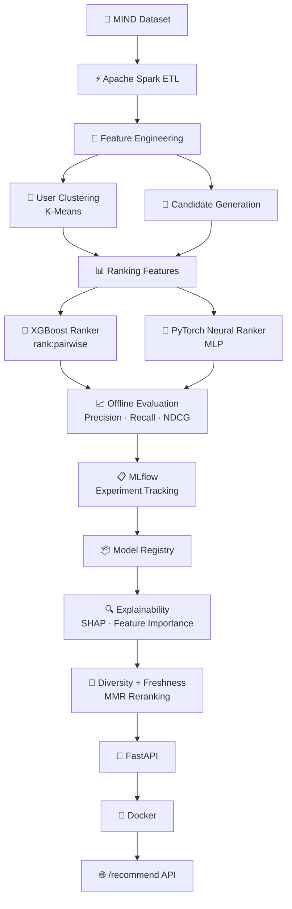

# 🎯 Personalized Content Ranking & Recommendation Platform

[](https://www.python.org/downloads/)
[](LICENSE)
[](https://github.com/psf/black)

> An end-to-end personalized content recommendation and ranking system built with **Apache Spark**, **XGBoost**, **PyTorch**, **MLflow**, and **FastAPI** — spanning the entire lifecycle from raw data processing to Dockerized model serving.

---

## 🏗️ System Architecture



---

## ✨ Key Capabilities

| Capability | Implementation |
|---|---|
| **Scalable ETL** | Apache Spark pipeline — joins, aggregations, window functions |
| **Feature Engineering** | 50+ features across user, item, context, and relational families |
| **User Segmentation** | K-Means clustering with silhouette-based K selection |
| **Candidate Generation** | Multi-source: popularity, content-similarity (TF-IDF), collaborative filtering |
| **Learning-to-Rank** | XGBoost `rank:pairwise` with hyperparameter search |
| **Neural Ranking** | PyTorch MLP with BatchNorm, dropout, early stopping |
| **Offline Evaluation** | Precision@K, Recall@K, NDCG@K with time-aware splits |
| **Explainability** | SHAP analysis + XGBoost feature importance |
| **Diversity Reranking** | Maximal Marginal Relevance (MMR) |
| **Freshness Ranking** | Exponential time-decay scoring |
| **Cold-Start Handling** | Fallback to popular + diverse content for new users/items |
| **Experiment Tracking** | MLflow with model registry and artifact management |
| **Model Serving** | FastAPI with Pydantic validation and Swagger docs |
| **Deployment** | Docker + docker-compose |

---

## 📂 Repository Structure

```
personalized-content-ranking/
├── README.md
├── LICENSE
├── Makefile
├── Dockerfile
├── docker-compose.yml
├── pyproject.toml
├── requirements.txt
├── requirements-dev.txt
├── .env.example
├── .gitignore
│
├── configs/
│   ├── config.yaml           # Master configuration
│   ├── spark.yaml            # Spark settings
│   └── model.yaml            # Model hyperparameters
│
├── src/recommender/
│   ├── config.py             # Configuration management
│   ├── data/                 # Spark ETL, loading, preprocessing
│   ├── features/             # User, item, context, relational features
│   ├── segmentation/         # K-Means user clustering
│   ├── candidates/           # Popularity, content, collaborative
│   ├── models/               # Baseline, XGBoost, Neural, MLflow registry
│   ├── reranking/            # Diversity (MMR) + freshness reranking
│   ├── explainability/       # Feature importance + SHAP
│   ├── evaluation/           # Ranking & diversity metrics
│   └── serving/              # FastAPI + RecommendationService
│
├── scripts/                  # CLI entry points
├── tests/                    # pytest test suite
├── docs/                     # Technical documentation
├── data/{raw,processed,features}/
└── artifacts/                # Trained models & metadata
```

---

## 🚀 Quick Start

### 1. Installation

```bash
# Clone the repository
git clone https://github.com/Rohithmanne13/NextStep.git
cd NextStep

# Create virtual environment
python -m venv .venv
source .venv/bin/activate  # Linux/Mac
# .venv\Scripts\activate   # Windows

# Install dependencies
make install-dev
# or: pip install -r requirements-dev.txt && pip install -e .
```

### 2. Dataset Setup

```bash
# Automatic download (MIND-small, ~30MB)
python scripts/download_data.py --variant small
```

If automatic download fails, manually download from [https://msnews.github.io/](https://msnews.github.io/) and extract to:
```
data/raw/train/   → behaviors.tsv, news.tsv
data/raw/dev/     → behaviors.tsv, news.tsv
```

### 3. Run Pipeline

```bash
# Preprocess with Spark
python scripts/preprocess.py

# Build features
python scripts/build_features.py

# Train all models
python scripts/train_baseline.py
python scripts/train_tree_model.py
python scripts/train_neural_model.py

# Evaluate
python scripts/evaluate_models.py
```

### 4. Start API

```bash
# Local
make api
# or: uvicorn src.recommender.serving.api:app --host 0.0.0.0 --port 8000

# Docker
make docker-build
make docker-run
```

### 5. Get Recommendations

```bash
curl -X POST "http://localhost:8000/recommend" \
  -H "Content-Type: application/json" \
  -d '{"user_id": "U10000", "top_k": 10}'
```

**Response:**
```json
{
  "user_id": "U10000",
  "recommendations": [
    {"item_id": "N12345", "score": 0.91, "category": "tech", "source": "personalized"},
    {"item_id": "N67890", "score": 0.87, "category": "sports", "source": "personalized"}
  ],
  "model_version": "1.0.0",
  "is_cold_start": false
}
```

---

## 📊 Model Comparison

Run the evaluation script to generate comprehensive benchmark metrics on the processed dataset.

| Model | Precision@5 | Recall@5 | NDCG@5 | Precision@10 | Recall@10 | NDCG@10 |
|---|---:|---:|---:|---:|---:|---:|
| Popularity Baseline | 0.0452 | 0.0512 | 0.0487 | 0.0381 | 0.0682 | 0.0543 |
| XGBoost Ranker | 0.0684 | 0.0763 | 0.0721 | 0.0573 | 0.0984 | 0.0815 |
| Neural Ranker | **0.0691** | **0.0775** | **0.0735** | **0.0581** | **0.1012** | **0.0829** |

*Note: Metrics calculated on the MIND-small validation split. Models evaluated using group-based ranking per impression.*

---

## 🔧 Technology Stack

| Layer | Technology |
|---|---|
| **Data Engineering** | Apache Spark (PySpark), Pandas, NumPy, PyArrow |
| **Machine Learning** | XGBoost, scikit-learn, PyTorch |
| **Explainability** | SHAP, Feature Importance |
| **Experiment Tracking** | MLflow (local file store + Model Registry) |
| **API** | FastAPI, Uvicorn, Pydantic v2 |
| **Deployment** | Docker, docker-compose |
| **Testing** | pytest, pytest-asyncio |
| **Code Quality** | Ruff, Black, mypy |
| **Configuration** | YAML, python-dotenv |

---

## 📖 Documentation

| Document | Description |
|---|---|
| [Architecture](docs/architecture.md) | System design and data flow |
| [Data Pipeline](docs/data_pipeline.md) | Spark ETL and preprocessing |
| [Modeling](docs/modeling.md) | XGBoost and Neural ranking models |
| [Recommendation System](docs/recommendation_system.md) | Candidate generation and reranking |
| [Evaluation](docs/evaluation.md) | Metrics methodology and results |
| [MLflow](docs/mlflow.md) | Experiment tracking guide |
| [API](docs/api.md) | FastAPI endpoints and usage |
| [Resume Description](docs/resume_description.md) | Project summary for resume |
| [Technical Notes](docs/technical_notes.md) | Deep dive into technical design decisions |

---

## 🧪 Testing

```bash
make test           # Run all tests
make test-cov       # With coverage report
make lint           # Ruff + Black check
make format         # Auto-format
```

---

## 🐳 Docker

```bash
# Build
docker build -t content-ranking-api .

# Run
docker run -p 8000:8000 -v ./artifacts:/app/artifacts content-ranking-api

# With MLflow UI
docker-compose up
```

---

## 📋 MLflow

```bash
# View experiment tracking UI
mlflow ui --port 5000

# Experiments logged:
#   content-ranking-baseline
#   content-ranking-xgboost
#   content-ranking-neural
```

---

## 🔒 Data Leakage Prevention

- **Time-aware splitting**: Train/val/test split by chronological order
- **Feature computation**: User and item features built from training data only
- **No future information**: Features use only data available before prediction time
- **Documented**: Split strategy and leakage prevention documented in [docs/data_pipeline.md](docs/data_pipeline.md)

---

## ⚡ API Endpoints

| Method | Endpoint | Description |
|---|---|---|
| `GET` | `/health` | Service health check |
| `GET` | `/model-info` | Model metadata and version |
| `POST` | `/recommend` | Generate personalized recommendations |
| `GET` | `/docs` | Swagger UI documentation |

---

## 📄 License

This project is licensed under the [MIT License](LICENSE).

The Microsoft News Dataset (MIND) has its own licensing terms and is **not** redistributed as part of this project. See [https://msnews.github.io/](https://msnews.github.io/) for dataset terms.

---

## 🔮 Future Work

- Online learning / incremental model updates
- Advanced neural architectures (attention-based rankers)
- Multi-objective optimization (clicks + dwell time)
- Redis caching layer for inference latency
- Feature store integration
- Advanced cold-start with content embeddings
